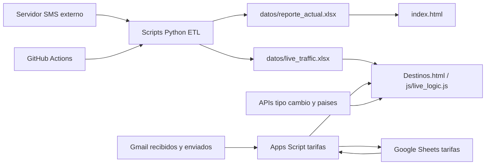

# Arquitectura y Tecnologias del Dashboard Telvoice

Este documento resume la arquitectura actual del proyecto, las tecnologias utilizadas y los puntos clave que una persona nueva necesita entender antes de contribuir.

## 1. Proposito del Proyecto

Dashboard Telvoice es una aplicacion web estatica para analizar trafico SMS, costos, ventas, destinos, proveedores y trafico reciente.

El sistema combina:

- Un frontend HTML/CSS/JavaScript sin framework.
- Archivos Excel versionados en `datos/` como fuente principal para la UI.
- Scripts Python que descargan, normalizan y actualizan esos Excel.
- GitHub Actions para ejecutar actualizaciones programadas.
- APIs externas para banderas, tipo de cambio y datos maestros de destinos.

## 2. Arquitectura General



### Flujo principal

1. Los scripts Python inician sesion contra el servidor SMS externo.
2. Descargan reportes Excel desde el endpoint de reportes.
3. Normalizan columnas, monedas, fechas y dimensiones.
4. Guardan archivos procesados en `datos/`.
5. El frontend lee esos Excel con SheetJS desde el navegador.
6. Chart.js renderiza graficos y tablas a partir de esos datos.

## 3. Estructura de Archivos

```text
.
|-- index.html
|-- Destinos.html
|-- js/
|   |-- config.js
|   `-- live_logic.js
|-- apps-script/
|   |-- appsscript.json
|   |-- Api.gs
|   |-- Constants.gs
|   |-- MailProcessor.gs
|   |-- Parser.gs
|   |-- Setup.gs
|   |-- Storage.gs
|   |-- Tests.gs
|   `-- README.md
|-- datos/
|   |-- reporte_actual.xlsx
|   `-- live_traffic.xlsx
|-- update_data.py
|-- update_live.py
|-- importar_historico.py
|-- recuperar_datos.py
`-- .github/
    `-- workflows/
        |-- bot_diario.yml
        |-- live_worker.yml
        |-- importar.yml
        `-- rescate.yml
```

## 4. Frontend

### `index.html`

Pantalla principal del dashboard financiero.

Responsabilidades:

- Login simple con hash SHA-256 en cliente.
- Carga de `datos/reporte_actual.xlsx`.
- Filtros por fecha, cliente, pais y operador.
- KPIs principales: mensajes, ingresos, costos, utilidad, DLR y latencia.
- Grafico de pastel: volumen real por destino.
- Grafico de barras: tendencia diaria.
- Grafico combinado por vendor: barras de `MessageParts` y linea de `TerminationCostUSD`, ordenado por volumen y limitado mediante selector.
- Selector independiente para ver la tendencia de los ultimos `7`, `14`, `30`, `60` o `90` dias sin modificar los otros componentes.
- Drill-down interactivo: al seleccionar una barra diaria, los graficos de destino y vendor muestran el detalle de ese dia sin modificar KPIs, filtros ni tabla.
- El boton `Ver total` restaura simultaneamente ambos graficos analiticos.
- Tabla de desglose financiero por cliente.

Tecnologias usadas:

- HTML, CSS y JavaScript vanilla.
- Chart.js para graficos.
- SheetJS (`xlsx.full.min.js`) para leer Excel en navegador.
- `sessionStorage` para mantener sesion local tras login.

### `Destinos.html`

Pantalla de cobertura, costos, precios de venta y trafico live por pais.

Responsabilidades:

- Carga datos maestros desde un Google Apps Script.
- Normaliza formato plano de tarifas y formato historico `{ costos, ventas }`.
- Carga banderas desde `restcountries.com`.
- Carga tipo de cambio EUR/USD desde `open.er-api.com`.
- Carga volumen live desde `datos/live_traffic.xlsx`.
- Muestra tarjetas por pais con proveedores, costos, ventas y trafico reciente.

Tecnologias usadas:

- HTML, CSS y JavaScript.
- Bootstrap 5 para modales y estilos base.
- jQuery para manipulacion de DOM.
- SheetJS para leer `live_traffic.xlsx`.

### `js/live_logic.js`

Modulo JavaScript compartido por `Destinos.html` para abrir el modal de trafico live.

Responsabilidades:

- Leer `datos/live_traffic.xlsx`.
- Filtrar registros por `CountryRealName`.
- Mostrar hora, numero, operador, cliente, ruta, vendor, status, delay y mensaje.

## 5. Datos

### `datos/reporte_actual.xlsx`

Fuente principal de `index.html`.

Contiene datos historicos agregados por dimensiones como:

- `SubmitDate`
- `CompanyName`
- `SMPPAccountName`
- `MCC`
- `MNC`
- `OperatorName`
- `DLRStatus`
- `VendorAccountName`
- `CountryRealName`
- `CurrencyCode`
- `TerminationCurrencyCode`

Y metricas como:

- `MessageParts`
- `ClientCost`
- `TerminationCost`
- `ClientCostUSD`
- `TerminationCostUSD`
- `DLRDelay`

### `datos/live_traffic.xlsx`

Fuente de trafico reciente para `Destinos.html` y `js/live_logic.js`.

Se genera con datos de las ultimas horas y se usa para mostrar registros recientes por pais.

## 6. Backend / ETL en Python

No existe backend web propio. La capa backend del proyecto son scripts Python ejecutados localmente o por GitHub Actions.

### `update_data.py`

Actualizacion diaria del historico.

Responsabilidades:

- Login contra servidor SMS.
- Descarga del reporte del dia anterior.
- Normalizacion de columnas.
- Conversion de costos a USD.
- Agrupacion por dimensiones oficiales.
- Reemplazo seguro del dia actualizado en `reporte_actual.xlsx`.

### `update_live.py`

Actualizacion de trafico reciente.

Responsabilidades:

- Login contra servidor SMS.
- Descarga de trafico de las ultimas 12 horas.
- Ordena por `SubmitDate`.
- Guarda `datos/live_traffic.xlsx`.

### `importar_historico.py`

Importacion historica inicial o reconstruccion amplia.

Responsabilidades:

- Descargar bloques historicos.
- Convertir monedas.
- Agrupar y consolidar el historico completo.
- Regenerar `datos/reporte_actual.xlsx`.

### `recuperar_datos.py`

Rescate manual de datos faltantes.

Responsabilidades:

- Descargar rangos especificos.
- Unirlos al historico existente.
- Reagrupar para evitar duplicados.

## 7. Automatizaciones GitHub Actions

### `.github/workflows/bot_diario.yml`

Actualizacion diaria.

- Schedule: todos los dias a las `03:01 UTC`.
- Ejecuta `update_data.py`.
- Usa secretos `SMS_USER` y `SMS_PASS`.
- Commit del nuevo `datos/reporte_actual.xlsx`.

### `.github/workflows/live_worker.yml`

Actualizacion live.

- Schedule: cada 30 minutos.
- Ejecuta `update_live.py`.
- Commit del nuevo `datos/live_traffic.xlsx`.

### `.github/workflows/importar.yml`

Importacion historica manual.

- Solo `workflow_dispatch`.
- Ejecuta `importar_historico.py`.
- Regenera `datos/reporte_actual.xlsx`.

### `.github/workflows/rescate.yml`

Rescate manual.

- Solo `workflow_dispatch`.
- Ejecuta `recuperar_datos.py`.
- Actualiza `datos/reporte_actual.xlsx`.

## 8. Dependencias

### Frontend por CDN

- Chart.js
- SheetJS / xlsx
- Bootstrap 5
- jQuery
- Google Fonts Inter

### Python

Instaladas en GitHub Actions:

- `pandas`
- `openpyxl`
- `requests`
- `beautifulsoup4`
- `lxml`
- `python-dateutil` en importacion historica

## 9. Servicios Externos

### Servidor SMS

Usado por los scripts Python para descargar reportes.

Requiere:

- `SMS_USER`
- `SMS_PASS`

Estos valores deben configurarse como secretos en GitHub Actions y nunca hardcodearse.

### Google Apps Script

Usado por `Destinos.html` para obtener tarifas y rutas.

El codigo versionado vive en `apps-script/` y automatiza:

- Lectura de adjuntos `csv`, `xlsx` y `xls` desde Gmail.
- Clasificacion de compras por remitente y ventas por destinatario.
- Parsers configurables por proveedor o cliente.
- Normalizacion por pais, ruta, MCC, MNC, operador, tarifa y moneda.
- Actualizacion por llave `tipo + actor + ruta + MCC + MNC`.
- Historial, deduplicacion y registro de errores.
- Publicacion JSON con `{ costos, ventas, meta }`.

La URL publica se configura en `js/config.js`. El frontend sigue aceptando el
contrato historico `{ costos, ventas }`, por lo que `meta` es opcional.

La instalacion y configuracion de las hojas `actores`, `plantillas`,
`catalogo_rutas`, `costos_actuales`, `ventas_actuales`,
`historial_importaciones` y `errores` esta documentada en
`apps-script/README.md`.

### APIs auxiliares

- `restcountries.com`: obtiene codigos ISO para banderas.
- `open.er-api.com`: obtiene tasa EUR/USD actual.
- `frankfurter.app`: conversion historica EUR/USD en scripts Python.
- `mindicador.cl`: conversion historica CLP/USD en scripts Python.

## 10. Como Correr Localmente

No se recomienda abrir los HTML con doble click, porque el navegador puede bloquear `fetch()` contra archivos locales.

Usar un servidor HTTP local desde la raiz del proyecto:

```powershell
cd "C:\Users\Riki\Desktop\Dashboard Telvoice"
node -e "const http=require('http'),fs=require('fs'),path=require('path');const root=process.cwd();const types={'.html':'text/html; charset=utf-8','.js':'text/javascript; charset=utf-8','.xlsx':'application/vnd.openxmlformats-officedocument.spreadsheetml.sheet'};http.createServer((req,res)=>{const u=new URL(req.url,'http://127.0.0.1');const p=path.normalize(path.join(root,u.pathname==='/'?'/index.html':decodeURIComponent(u.pathname)));if(!p.startsWith(root)){res.writeHead(403);return res.end('Forbidden')}fs.readFile(p,(e,d)=>{if(e){res.writeHead(404);return res.end('Not found')}res.writeHead(200,{'Content-Type':types[path.extname(p).toLowerCase()]||'application/octet-stream'});res.end(d)})}).listen(5500,'127.0.0.1',()=>console.log('http://127.0.0.1:5500/index.html'))"
```

Abrir:

- `http://127.0.0.1:5500/index.html`
- `http://127.0.0.1:5500/Destinos.html`

Detener con `Ctrl + C` en la terminal donde corre el servidor.

## 11. Consideraciones de Seguridad

- El login del frontend es solo una barrera basica del lado cliente; no reemplaza autenticacion real de servidor.
- Los secretos reales deben vivir en GitHub Secrets.
- Los Excel en `datos/` quedan publicados junto al frontend si el sitio se sirve publicamente.
- Evitar subir credenciales, sesiones o tokens al repositorio.

## 12. Puntos de Mantenimiento

- Si cambia el formato del Excel fuente, revisar `DIMENSIONES` y `METRICAS` en los scripts Python.
- Si cambia el Google Apps Script, validar `Destinos.html`, especialmente `normalizeDualData`, `mapCostRow` y `mapSaleRow`.
- Si cambia un formato de tarifas, actualizar su fila en `plantillas` antes de modificar el parser general.
- Si una ruta no publica, revisar primero `errores` y luego `catalogo_rutas`.
- Si los graficos no cargan, verificar primero que `datos/reporte_actual.xlsx` exista y sea descargable por HTTP.
- Si el trafico live no aparece, verificar `datos/live_traffic.xlsx` y el workflow `live_worker.yml`.
- Si hay errores de moneda, revisar APIs de conversion y fallback en los scripts Python.

## 13. Guia Rapida para Nuevos Colaboradores

1. Leer este documento.
2. Abrir `index.html` y entender el flujo de carga desde `reporte_actual.xlsx`.
3. Abrir `Destinos.html` y entender la carga de tarifas externas y trafico live.
4. Revisar `update_data.py` y `update_live.py`.
5. Revisar workflows de GitHub Actions.
6. Correr el servidor local y probar ambos HTML.
7. Antes de modificar columnas, confirmar impacto en frontend, scripts y Excel.
